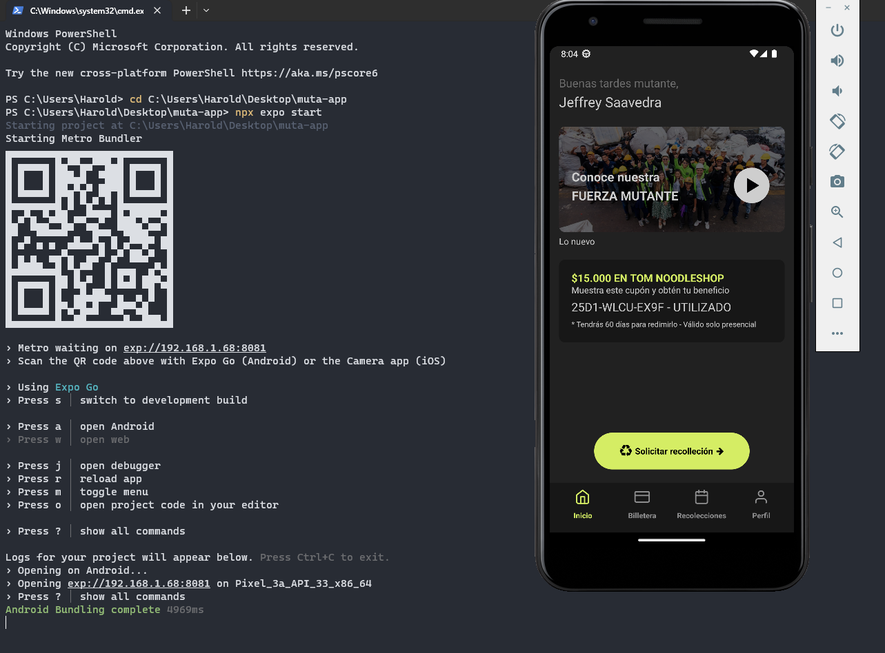

# Muta App React Native

## Authors

- [@haroldmartinez10](https://github.com/haroldmartinez10)

## Run Locally

Install expo-cli

```bash
  npm install -g expo-cli
```

Go to the project directory

```bash
  cd my-project
```

Install dependencies

```bash
  cd my-project
  npm install
```

Start the server

```bash
npx expo start | expo start
```


